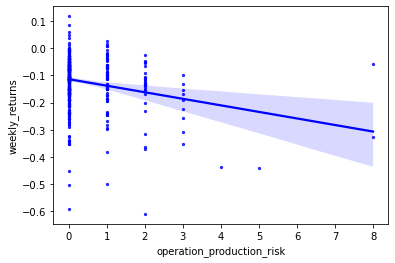
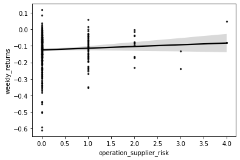
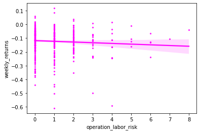
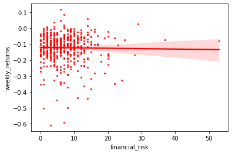
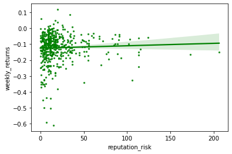

---
layout: wide_default
---    

# Analysis Report

This report analyzes risk measurements for each of the S&P 500 firms using their year-ending 2019 10k's. These risks were calculated by using the function `near_regex`, which finds certain keywords near each other and outputs the number of times these keywords are within a specific distance from one another. I measured each risk with a max distance of 20 words between the keywords because I believe that is an appropriate distance apart within 1-2 sentences. Once the function runs through all of the 10k's, the output for each risk is stored as a new column in the S&P 500 dataframe.

The first part of the report, which is **code-heavy**, loads the 2019 accounting data, creates a weekly return for each firm from March 9th-March 13th, 2020, and then merges that to the S&P 500 dataframe. The second half of the report, which is **analysis-heavy**, examines the risk measurements and correlations between stock prices and risk appearances.

## Part 1: Stock Returns


```python
import pandas as pd
import pandas_datareader as pdr
from datetime import datetime
import matplotlib.pyplot as plt
import numpy as np
import seaborn as sns
```


```python
# load sp500 dataset
sp500 = pd.read_csv('output/sp500_accting_plus_textrisks.csv')

# drop _merge column in order to merge later
sp500 = sp500.drop(columns = ['_merge'])

# load stock returns data and rename ticker column to align with 'Symbol' in sp500
stock_returns = pd.read_stata('2019-2020-stock_rets cleaned.zip').rename(columns = {'ticker':'Symbol'})

# set date range March 9 - March 13, 2020
start = 20200309
end = 20200313

# filter so that date range is 3/9 - 3/13
date_range = (stock_returns['date'] >= start) & (stock_returns['date'] <= end)

# insert filter into stock_returns
stock_returns = stock_returns.loc[date_range].set_index('date')

# change column type to numeric
stock_returns['ret'] = pd.to_numeric(stock_returns['ret'])

# create weekly returns
stock_returns = stock_returns.assign(weekly_returns = 1+stock_returns['ret']).groupby(['Symbol'])['weekly_returns'].prod()-1

# create a new dataframe
stock_returns = stock_returns.to_frame().reset_index()
```


```python
stock_returns
```


<div>
<style scoped>
    .dataframe tbody tr th:only-of-type {
        vertical-align: middle;
    }

    .dataframe tbody tr th {
        vertical-align: top;
    }

    .dataframe thead th {
        text-align: right;
    }
</style>
<table border="1" class="dataframe">
  <thead>
    <tr style="text-align: right;">
      <th></th>
      <th>Symbol</th>
      <th>weekly_returns</th>
    </tr>
  </thead>
  <tbody>
    <tr>
      <th>0</th>
      <td>A</td>
      <td>-0.119144</td>
    </tr>
    <tr>
      <th>1</th>
      <td>AA</td>
      <td>-0.273389</td>
    </tr>
    <tr>
      <th>2</th>
      <td>AAL</td>
      <td>-0.103944</td>
    </tr>
    <tr>
      <th>3</th>
      <td>AAN</td>
      <td>-0.133448</td>
    </tr>
    <tr>
      <th>4</th>
      <td>AAON</td>
      <td>-0.116500</td>
    </tr>
    <tr>
      <th>...</th>
      <td>...</td>
      <td>...</td>
    </tr>
    <tr>
      <th>1911</th>
      <td>ZM</td>
      <td>-0.059920</td>
    </tr>
    <tr>
      <th>1912</th>
      <td>ZNGA</td>
      <td>-0.072238</td>
    </tr>
    <tr>
      <th>1913</th>
      <td>ZS</td>
      <td>-0.151853</td>
    </tr>
    <tr>
      <th>1914</th>
      <td>ZTO</td>
      <td>-0.037593</td>
    </tr>
    <tr>
      <th>1915</th>
      <td>ZTS</td>
      <td>-0.084422</td>
    </tr>
  </tbody>
</table>
<p>1916 rows × 2 columns</p>
</div>


```python
# merge stock_returns with sp500
sp500 = pd.merge(sp500, stock_returns, how = "left", on = "Symbol", indicator = True, validate = "1:1")

sp500
```


<div>
<style scoped>
    .dataframe tbody tr th:only-of-type {
        vertical-align: middle;
    }

    .dataframe tbody tr th {
        vertical-align: top;
    }

    .dataframe thead th {
        text-align: right;
    }
</style>
<table border="1" class="dataframe">
  <thead>
    <tr style="text-align: right;">
      <th></th>
      <th>Unnamed: 0</th>
      <th>Symbol</th>
      <th>Security</th>
      <th>SEC filings</th>
      <th>GICS Sector</th>
      <th>GICS Sub-Industry</th>
      <th>Headquarters Location</th>
      <th>Date first added</th>
      <th>CIK</th>
      <th>Founded</th>
      <th>...</th>
      <th>ppe_a</th>
      <th>cash_a</th>
      <th>xrd_a</th>
      <th>dltt_a</th>
      <th>invopps_FG09</th>
      <th>sales_g</th>
      <th>dv_a</th>
      <th>short_debt</th>
      <th>weekly_returns</th>
      <th>_merge</th>
    </tr>
  </thead>
  <tbody>
    <tr>
      <th>0</th>
      <td>0</td>
      <td>MMM</td>
      <td>3M</td>
      <td>reports</td>
      <td>Industrials</td>
      <td>Industrial Conglomerates</td>
      <td>Saint Paul, Minnesota</td>
      <td>1976-08-09</td>
      <td>66740</td>
      <td>1902</td>
      <td>...</td>
      <td>0.228196</td>
      <td>0.065407</td>
      <td>0.042791</td>
      <td>0.408339</td>
      <td>2.749554</td>
      <td>NaN</td>
      <td>0.074252</td>
      <td>0.143810</td>
      <td>-0.077905</td>
      <td>both</td>
    </tr>
    <tr>
      <th>1</th>
      <td>1</td>
      <td>AOS</td>
      <td>A. O. Smith</td>
      <td>reports</td>
      <td>Industrials</td>
      <td>Building Products</td>
      <td>Milwaukee, Wisconsin</td>
      <td>2017-07-26</td>
      <td>91142</td>
      <td>1916</td>
      <td>...</td>
      <td>0.193689</td>
      <td>0.180314</td>
      <td>0.028744</td>
      <td>0.103303</td>
      <td>NaN</td>
      <td>NaN</td>
      <td>0.048790</td>
      <td>0.056170</td>
      <td>-0.028109</td>
      <td>both</td>
    </tr>
    <tr>
      <th>2</th>
      <td>2</td>
      <td>ABT</td>
      <td>Abbott</td>
      <td>reports</td>
      <td>Health Care</td>
      <td>Health Care Equipment</td>
      <td>North Chicago, Illinois</td>
      <td>1964-03-31</td>
      <td>1800</td>
      <td>1888</td>
      <td>...</td>
      <td>0.132161</td>
      <td>0.060984</td>
      <td>0.035942</td>
      <td>0.256544</td>
      <td>2.520681</td>
      <td>NaN</td>
      <td>0.033438</td>
      <td>0.088120</td>
      <td>-0.001101</td>
      <td>both</td>
    </tr>
    <tr>
      <th>3</th>
      <td>3</td>
      <td>ABBV</td>
      <td>AbbVie</td>
      <td>reports</td>
      <td>Health Care</td>
      <td>Pharmaceuticals</td>
      <td>North Chicago, Illinois</td>
      <td>2012-12-31</td>
      <td>1551152</td>
      <td>2013 (1888)</td>
      <td>...</td>
      <td>0.037098</td>
      <td>0.448005</td>
      <td>0.076216</td>
      <td>0.709488</td>
      <td>2.211589</td>
      <td>NaN</td>
      <td>0.071436</td>
      <td>0.057566</td>
      <td>-0.038844</td>
      <td>both</td>
    </tr>
    <tr>
      <th>4</th>
      <td>4</td>
      <td>ABMD</td>
      <td>Abiomed</td>
      <td>reports</td>
      <td>Health Care</td>
      <td>Health Care Equipment</td>
      <td>Danvers, Massachusetts</td>
      <td>2018-05-31</td>
      <td>815094</td>
      <td>1981</td>
      <td>...</td>
      <td>0.137531</td>
      <td>0.466354</td>
      <td>0.088683</td>
      <td>0.000000</td>
      <td>12.164233</td>
      <td>NaN</td>
      <td>0.000000</td>
      <td>NaN</td>
      <td>-0.090781</td>
      <td>both</td>
    </tr>
    <tr>
      <th>...</th>
      <td>...</td>
      <td>...</td>
      <td>...</td>
      <td>...</td>
      <td>...</td>
      <td>...</td>
      <td>...</td>
      <td>...</td>
      <td>...</td>
      <td>...</td>
      <td>...</td>
      <td>...</td>
      <td>...</td>
      <td>...</td>
      <td>...</td>
      <td>...</td>
      <td>...</td>
      <td>...</td>
      <td>...</td>
      <td>...</td>
      <td>...</td>
    </tr>
    <tr>
      <th>500</th>
      <td>500</td>
      <td>YUM</td>
      <td>Yum! Brands</td>
      <td>reports</td>
      <td>Consumer Discretionary</td>
      <td>Restaurants</td>
      <td>Louisville, Kentucky</td>
      <td>1997-10-06</td>
      <td>1041061</td>
      <td>1997</td>
      <td>...</td>
      <td>0.346396</td>
      <td>0.142038</td>
      <td>0.000000</td>
      <td>1.071959</td>
      <td>8.046718</td>
      <td>NaN</td>
      <td>0.097687</td>
      <td>0.044192</td>
      <td>-0.122372</td>
      <td>both</td>
    </tr>
    <tr>
      <th>501</th>
      <td>501</td>
      <td>ZBRA</td>
      <td>Zebra</td>
      <td>reports</td>
      <td>Information Technology</td>
      <td>Electronic Equipment &amp; Instruments</td>
      <td>Lincolnshire, Illinois</td>
      <td>2019-12-23</td>
      <td>877212</td>
      <td>1969</td>
      <td>...</td>
      <td>0.077691</td>
      <td>0.006368</td>
      <td>0.094884</td>
      <td>0.250478</td>
      <td>3.225952</td>
      <td>NaN</td>
      <td>0.000000</td>
      <td>0.160740</td>
      <td>-0.092335</td>
      <td>both</td>
    </tr>
    <tr>
      <th>502</th>
      <td>502</td>
      <td>ZBH</td>
      <td>Zimmer Biomet</td>
      <td>reports</td>
      <td>Health Care</td>
      <td>Health Care Equipment</td>
      <td>Warsaw, Indiana</td>
      <td>2001-08-07</td>
      <td>1136869</td>
      <td>1927</td>
      <td>...</td>
      <td>0.095139</td>
      <td>0.025078</td>
      <td>0.021081</td>
      <td>0.281545</td>
      <td>1.556915</td>
      <td>NaN</td>
      <td>0.007983</td>
      <td>0.184000</td>
      <td>-0.211926</td>
      <td>both</td>
    </tr>
    <tr>
      <th>503</th>
      <td>503</td>
      <td>ZION</td>
      <td>Zions Bancorp</td>
      <td>reports</td>
      <td>Financials</td>
      <td>Regional Banks</td>
      <td>Salt Lake City, Utah</td>
      <td>2001-06-22</td>
      <td>109380</td>
      <td>1873</td>
      <td>...</td>
      <td>NaN</td>
      <td>NaN</td>
      <td>NaN</td>
      <td>NaN</td>
      <td>NaN</td>
      <td>NaN</td>
      <td>NaN</td>
      <td>NaN</td>
      <td>-0.166100</td>
      <td>both</td>
    </tr>
    <tr>
      <th>504</th>
      <td>504</td>
      <td>ZTS</td>
      <td>Zoetis</td>
      <td>reports</td>
      <td>Health Care</td>
      <td>Pharmaceuticals</td>
      <td>Parsippany, New Jersey</td>
      <td>2013-06-21</td>
      <td>1555280</td>
      <td>1952</td>
      <td>...</td>
      <td>0.184409</td>
      <td>0.167518</td>
      <td>0.039584</td>
      <td>0.529320</td>
      <td>6.019250</td>
      <td>NaN</td>
      <td>0.027198</td>
      <td>0.080500</td>
      <td>-0.084422</td>
      <td>both</td>
    </tr>
  </tbody>
</table>
<p>505 rows × 55 columns</p>
</div>


## Part 2: Risk Measurements

## Operational Risks

#### Mechanical Description


```python
operation_production_risk = ['(production|operation)', '(delay|disrupt)']

operation_supplier_risk = ['(supplier|vendor)', '(failure|interrupt)']

operation_labor_risk = ['(labor|employee|union)', '(risk|strike)']
```

#### Economic Reasoning

From an operations perspective, there are numerous factors that need to be considered, and I chose to focus on production, suppliers, and labor risks. Operations management is vital in businesses across any industry, so I believed these risks would be relevant across numerous S&P 500 firms.

#### Statistical Properties

Although there were predominantly 0 hits, there was a combined total of 119 firms that had one hit. Companies like Amcor, Best Buy, Boeing, CVS Health, Idexx, Tesla, and TransDigm had at least one hit across all 3 risks. Companies like Boeing and Tesla make sense (and contribute to the validity of this search) because they are heavily reliant on operations/manufacturing processes. Below is a table of summary statistics, as well as value counts, of the 3 operational risks.


```python
operation_cols = ['operation_production_risk', 'operation_supplier_risk', 'operation_labor_risk']
sp500[operation_cols].describe()
```


<div>
<style scoped>
    .dataframe tbody tr th:only-of-type {
        vertical-align: middle;
    }

    .dataframe tbody tr th {
        vertical-align: top;
    }

    .dataframe thead th {
        text-align: right;
    }
</style>
<table border="1" class="dataframe">
  <thead>
    <tr style="text-align: right;">
      <th></th>
      <th>operation_production_risk</th>
      <th>operation_supplier_risk</th>
      <th>operation_labor_risk</th>
    </tr>
  </thead>
  <tbody>
    <tr>
      <th>count</th>
      <td>492.000000</td>
      <td>492.000000</td>
      <td>492.000000</td>
    </tr>
    <tr>
      <th>mean</th>
      <td>0.361789</td>
      <td>0.219512</td>
      <td>0.849593</td>
    </tr>
    <tr>
      <th>std</th>
      <td>0.897611</td>
      <td>0.542102</td>
      <td>1.233337</td>
    </tr>
    <tr>
      <th>min</th>
      <td>0.000000</td>
      <td>0.000000</td>
      <td>0.000000</td>
    </tr>
    <tr>
      <th>25%</th>
      <td>0.000000</td>
      <td>0.000000</td>
      <td>0.000000</td>
    </tr>
    <tr>
      <th>50%</th>
      <td>0.000000</td>
      <td>0.000000</td>
      <td>0.000000</td>
    </tr>
    <tr>
      <th>75%</th>
      <td>0.000000</td>
      <td>0.000000</td>
      <td>1.000000</td>
    </tr>
    <tr>
      <th>max</th>
      <td>8.000000</td>
      <td>4.000000</td>
      <td>8.000000</td>
    </tr>
  </tbody>
</table>
</div>


```python
sp500['operation_production_risk'].value_counts()
```


    0.0    385
    1.0     66
    2.0     27
    3.0      9
    8.0      2
    6.0      1
    5.0      1
    4.0      1
    Name: operation_production_risk, dtype: int64


```python
sp500['operation_supplier_risk'].value_counts()
```


    0.0    406
    1.0     70
    2.0     12
    4.0      2
    3.0      2
    Name: operation_supplier_risk, dtype: int64


```python
sp500['operation_labor_risk'].value_counts()
```


    0.0    261
    1.0    126
    2.0     64
    3.0     19
    4.0     12
    6.0      4
    5.0      4
    7.0      1
    8.0      1
    Name: operation_labor_risk, dtype: int64


#### Validation

When performing NLP "with my eyes," I found that a majority of the hits successfully captured operational issues. Below is an example from each of the 3 risks.
  
  - Production: in Tesla's 10k, there were several discussions about potential "production ramp delays," and also mentioned "delays in...production capacity for Gigafactory Shanghai."
  - Supplier: when Fox discusses the need for their suppliers to follow proper protocols, the 10k states that they "may be required to seek alternative suppliers or partners if these violations or failures were to occur."
  - Labor: 2019 was an eventful year for Boeing, a company that almost entirely relies on their operational expertise to differentiate themselves in the aviation industry. However, major operational deficiencies resulted in the second 737 Max crash to occur on March 10, 2019. Regarding labor risks, Boeing "experienced a work stoppage in 2008 when a labor strike halted commercial aircraft and certain BDS program production. [They] may experience additional work stoppages in the future, which could adversely affect [their] business."


## Financial Risks

#### Mechanical Description


```python
financial_risk = ['(fluctuate|fluctuation|volatility|decline)', '(price|pricing|cost|profit|revenue)']
```

#### Economic Reasoning

At the end of the day, every business's end goal is to make money, and when their ability to make profits is at risk, there are serious problems. I chose this risk because I believed there would be a significant number of hits across the 10k's.

#### Statistical Properties

Compared to the operational risks, my hypothesis was correct in that there were much more hits regarding financial risks than operational risks. This is because operational risks are more prevalent in certain industries than others, like manufacturing, whereas financial risks are essential in every industry. In fact, there were only 23 total companies with 0 hits. BlackRock was the one company with 53 hits, which makes sense since they are an investment management organization. The summary statistics and value counts are shown below.


```python
sp500['financial_risk'].describe()
```


    count    492.000000
    mean       7.016260
    std        5.564264
    min        0.000000
    25%        3.000000
    50%        6.000000
    75%       10.000000
    max       53.000000
    Name: financial_risk, dtype: float64


```python
sp500['financial_risk'].value_counts().sort_index()
```


    0.0     23
    1.0     32
    2.0     41
    3.0     40
    4.0     54
    5.0     33
    6.0     47
    7.0     34
    8.0     30
    9.0     26
    10.0    32
    11.0    18
    12.0    17
    13.0    16
    14.0    12
    15.0     9
    16.0     4
    17.0     3
    18.0     3
    19.0     2
    20.0     7
    22.0     2
    23.0     1
    24.0     1
    25.0     1
    28.0     1
    29.0     1
    37.0     1
    53.0     1
    Name: financial_risk, dtype: int64


#### Validation

As mentioned previously, BlackRock had the highest number of hits which makes perfect sense for this risk. Discussions revolve around "volatility of income tax expense..." which affects "the Company's stock price." Also, "The expected stock volatility was based upon an average of historical stock price fluctuations."

While BlackRock was an example of a success, I was suprised to see a company like U.S. Bank only have 1 hit. The only match was "Deterioration in general business and economic conditions or turbulence in domestic or global financial markets could...increase stock price volatility," and that was in the Forward-Looking Statement section of the 10k, not the Risk Factors section. In fact, another interesting point about U.S. Bank is that they do not have a formal Risk Factors section. Instead, they state in 2 sentences that this information can be found in their 2019 Annual Report. "Information in response to this Item 1A can be found in the 2019 Annual Report on pages 146 to 156 under the heading 'Risk Factors.' That information is incorporated into this report by reference."

## Reputation Risks

#### Mechanical Description


```python
reputation_risk = ['(brand|company|reputation|image)', '(risk|damage|harm|negative|adversely)']
```

#### Economic Reasoning

Similarly to financial risks, every company is concerned with how they are viewed by stakeholders, investors, and the general public. Because of that, I hoped my keywords would capture a high hit count as companies constantly need to assess risk factors that can hurt their reputation.

#### Statistical Properties

My hypothesis held true in that the vast majority of companies are addressing reputation risks. This risk has both the most and highest values of any of the other risks, as Aflac has 206 total values. 


```python
sp500['reputation_risk'].describe()
```


    count    492.000000
    mean      20.134146
    std       24.144809
    min        0.000000
    25%        6.750000
    50%       12.000000
    75%       23.000000
    max      206.000000
    Name: reputation_risk, dtype: float64


```python
sp500['reputation_risk'].value_counts().sort_index()
```


    0.0       8
    1.0      13
    2.0      19
    3.0      20
    4.0      25
             ..
    113.0     4
    115.0     1
    124.0     1
    173.0     1
    206.0     1
    Name: reputation_risk, Length: 76, dtype: int64


#### Validation

In Aflac's 10k, there are several instances of "the Company's operations and reputation could be adversely affected" by various factors like litigation, noncompliance, data security breaches, and others. These are all instances I fully expected to be captured from the keywords.

I was more surprised by the fact that there were 8 companies with 0 matches, one of them being Goldman Sachs. When I opened their 10k, their entire report is 8 total pages, so it is much more abbreviated than most other firms' reports. Abbott Laboratories was a major surprise to have 0 values because they discuss 'reputation' over 50 times throughout their 10k. In this instance, I believe my keywords were not aligned to the diction used in the 10k. After scanning the report, words such as "breach" and "incur" are more relevant keywords that would have delivered a positive number as an output.

## Describing the *Final* Sample

When describing the entire dataframe below, one aspect that stands out is the varying observation counts of each variable (the 5 risks I created have 492 observations, while gvkey has 355, weekly_returns has 490, etc.). This tells me that there is missing data within the "2019 ccm_cleaned.dta" file, which can create potential problems when performing analyses across different variables.


```python
sp500.describe()
```


<div>
<style scoped>
    .dataframe tbody tr th:only-of-type {
        vertical-align: middle;
    }

    .dataframe tbody tr th {
        vertical-align: top;
    }

    .dataframe thead th {
        text-align: right;
    }
</style>
<table border="1" class="dataframe">
  <thead>
    <tr style="text-align: right;">
      <th></th>
      <th>Unnamed: 0</th>
      <th>CIK</th>
      <th>financial_risk</th>
      <th>reputation_risk</th>
      <th>operation_production_risk</th>
      <th>operation_supplier_risk</th>
      <th>operation_labor_risk</th>
      <th>gvkey</th>
      <th>lpermno</th>
      <th>fyear</th>
      <th>...</th>
      <th>prof_a</th>
      <th>ppe_a</th>
      <th>cash_a</th>
      <th>xrd_a</th>
      <th>dltt_a</th>
      <th>invopps_FG09</th>
      <th>sales_g</th>
      <th>dv_a</th>
      <th>short_debt</th>
      <th>weekly_returns</th>
    </tr>
  </thead>
  <tbody>
    <tr>
      <th>count</th>
      <td>505.000000</td>
      <td>5.050000e+02</td>
      <td>492.000000</td>
      <td>492.000000</td>
      <td>492.000000</td>
      <td>492.000000</td>
      <td>492.000000</td>
      <td>355.000000</td>
      <td>355.000000</td>
      <td>355.000000</td>
      <td>...</td>
      <td>355.000000</td>
      <td>355.000000</td>
      <td>355.000000</td>
      <td>355.000000</td>
      <td>355.000000</td>
      <td>334.000000</td>
      <td>0.0</td>
      <td>355.000000</td>
      <td>349.000000</td>
      <td>490.000000</td>
    </tr>
    <tr>
      <th>mean</th>
      <td>252.000000</td>
      <td>7.887301e+05</td>
      <td>7.016260</td>
      <td>20.134146</td>
      <td>0.361789</td>
      <td>0.219512</td>
      <td>0.849593</td>
      <td>45305.952113</td>
      <td>53570.729577</td>
      <td>2018.884507</td>
      <td>...</td>
      <td>0.151314</td>
      <td>0.247454</td>
      <td>0.126002</td>
      <td>0.031169</td>
      <td>0.296568</td>
      <td>2.698513</td>
      <td>NaN</td>
      <td>0.025464</td>
      <td>0.112481</td>
      <td>-0.121810</td>
    </tr>
    <tr>
      <th>std</th>
      <td>145.925209</td>
      <td>5.501050e+05</td>
      <td>5.564264</td>
      <td>24.144809</td>
      <td>0.897611</td>
      <td>0.542102</td>
      <td>1.233337</td>
      <td>61170.060945</td>
      <td>30143.136238</td>
      <td>0.320067</td>
      <td>...</td>
      <td>0.074428</td>
      <td>0.218987</td>
      <td>0.138469</td>
      <td>0.050173</td>
      <td>0.181230</td>
      <td>2.107435</td>
      <td>NaN</td>
      <td>0.026991</td>
      <td>0.111168</td>
      <td>0.090491</td>
    </tr>
    <tr>
      <th>min</th>
      <td>0.000000</td>
      <td>1.800000e+03</td>
      <td>0.000000</td>
      <td>0.000000</td>
      <td>0.000000</td>
      <td>0.000000</td>
      <td>0.000000</td>
      <td>1045.000000</td>
      <td>10104.000000</td>
      <td>2018.000000</td>
      <td>...</td>
      <td>-0.323828</td>
      <td>0.009521</td>
      <td>0.002073</td>
      <td>0.000000</td>
      <td>0.000000</td>
      <td>0.405435</td>
      <td>NaN</td>
      <td>0.000000</td>
      <td>0.000000</td>
      <td>-0.610145</td>
    </tr>
    <tr>
      <th>25%</th>
      <td>126.000000</td>
      <td>9.747600e+04</td>
      <td>3.000000</td>
      <td>6.750000</td>
      <td>0.000000</td>
      <td>0.000000</td>
      <td>0.000000</td>
      <td>6286.000000</td>
      <td>19531.500000</td>
      <td>2019.000000</td>
      <td>...</td>
      <td>0.102413</td>
      <td>0.091581</td>
      <td>0.031900</td>
      <td>0.000000</td>
      <td>0.177941</td>
      <td>1.234730</td>
      <td>NaN</td>
      <td>0.000000</td>
      <td>0.028043</td>
      <td>-0.159331</td>
    </tr>
    <tr>
      <th>50%</th>
      <td>252.000000</td>
      <td>8.820950e+05</td>
      <td>6.000000</td>
      <td>12.000000</td>
      <td>0.000000</td>
      <td>0.000000</td>
      <td>0.000000</td>
      <td>13700.000000</td>
      <td>58683.000000</td>
      <td>2019.000000</td>
      <td>...</td>
      <td>0.138699</td>
      <td>0.162561</td>
      <td>0.072171</td>
      <td>0.009526</td>
      <td>0.285137</td>
      <td>2.155533</td>
      <td>NaN</td>
      <td>0.020454</td>
      <td>0.084992</td>
      <td>-0.106716</td>
    </tr>
    <tr>
      <th>75%</th>
      <td>378.000000</td>
      <td>1.137789e+06</td>
      <td>10.000000</td>
      <td>23.000000</td>
      <td>0.000000</td>
      <td>0.000000</td>
      <td>1.000000</td>
      <td>61582.500000</td>
      <td>82620.000000</td>
      <td>2019.000000</td>
      <td>...</td>
      <td>0.186883</td>
      <td>0.336729</td>
      <td>0.166690</td>
      <td>0.042936</td>
      <td>0.390672</td>
      <td>3.301717</td>
      <td>NaN</td>
      <td>0.037617</td>
      <td>0.151231</td>
      <td>-0.064739</td>
    </tr>
    <tr>
      <th>max</th>
      <td>504.000000</td>
      <td>1.868275e+06</td>
      <td>53.000000</td>
      <td>206.000000</td>
      <td>8.000000</td>
      <td>4.000000</td>
      <td>8.000000</td>
      <td>316056.000000</td>
      <td>93436.000000</td>
      <td>2019.000000</td>
      <td>...</td>
      <td>0.390384</td>
      <td>0.928562</td>
      <td>0.694612</td>
      <td>0.336795</td>
      <td>1.071959</td>
      <td>12.164233</td>
      <td>NaN</td>
      <td>0.138594</td>
      <td>0.761029</td>
      <td>0.117748</td>
    </tr>
  </tbody>
</table>
<p>8 rows × 45 columns</p>
</div>


## Regplots

The regplots below show the relationship between my risk measurements and the weekly stock returns during the week of March 9th - March 13th, 2020, when the COVID-19 pandemic began to seriously affect American businesses.

My initial hypothesis was that, as the instances of each risk increase in the 10k reports, the lower the weekly stock returns would be. That clearly held true for operation production risks, and slightly true for operation labor risks and financial risks (less negative slopes). Surprisingly, there are slightly positive correlations between weekly stock returns and risks for operation supplier and reputation (although their slopes are very close to 0 or no correlation). Regardless if the slope is slightly positive or horizontal, the data for those risks goes against my hypothesis that all risks have a negative relationship with weekly stock returns.


```python
sns.regplot(x="operation_production_risk", y="weekly_returns", data=sp500, scatter_kws={'s':5}, color='blue')
```


    <AxesSubplot:xlabel='operation_production_risk', ylabel='weekly_returns'>


    

    


```python
sns.regplot(x="operation_supplier_risk", y="weekly_returns", data=sp500, scatter_kws={'s':5}, color='black')
```


    <AxesSubplot:xlabel='operation_supplier_risk', ylabel='weekly_returns'>


    

    


```python
sns.regplot(x="operation_labor_risk", y="weekly_returns", data=sp500, scatter_kws={'s':5}, color='magenta')
```


    <AxesSubplot:xlabel='operation_labor_risk', ylabel='weekly_returns'>


    

    


```python
sns.regplot(x="financial_risk", y="weekly_returns", data=sp500, scatter_kws={'s':5}, color='red')
```


    <AxesSubplot:xlabel='financial_risk', ylabel='weekly_returns'>


    

    


```python
sns.regplot(x="reputation_risk", y="weekly_returns", data=sp500, scatter_kws={'s':5}, color='green')
```


    <AxesSubplot:xlabel='reputation_risk', ylabel='weekly_returns'>


    

    

